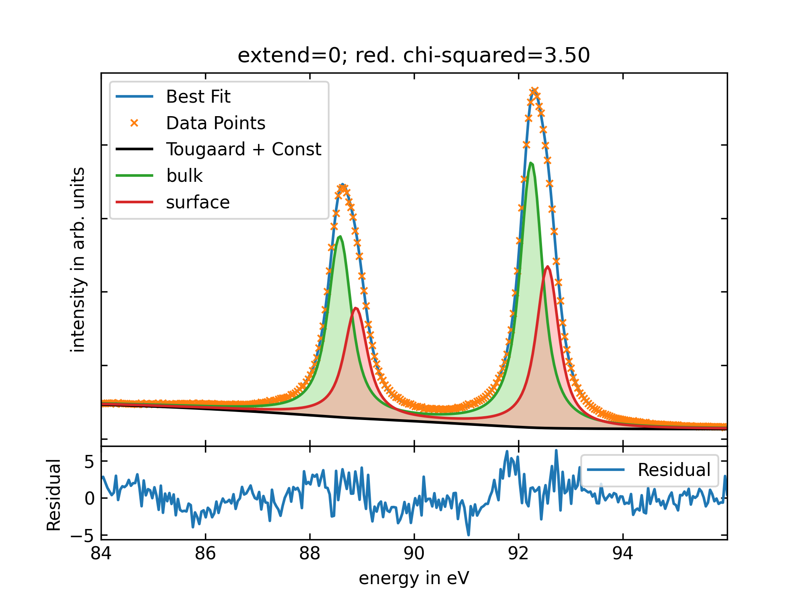
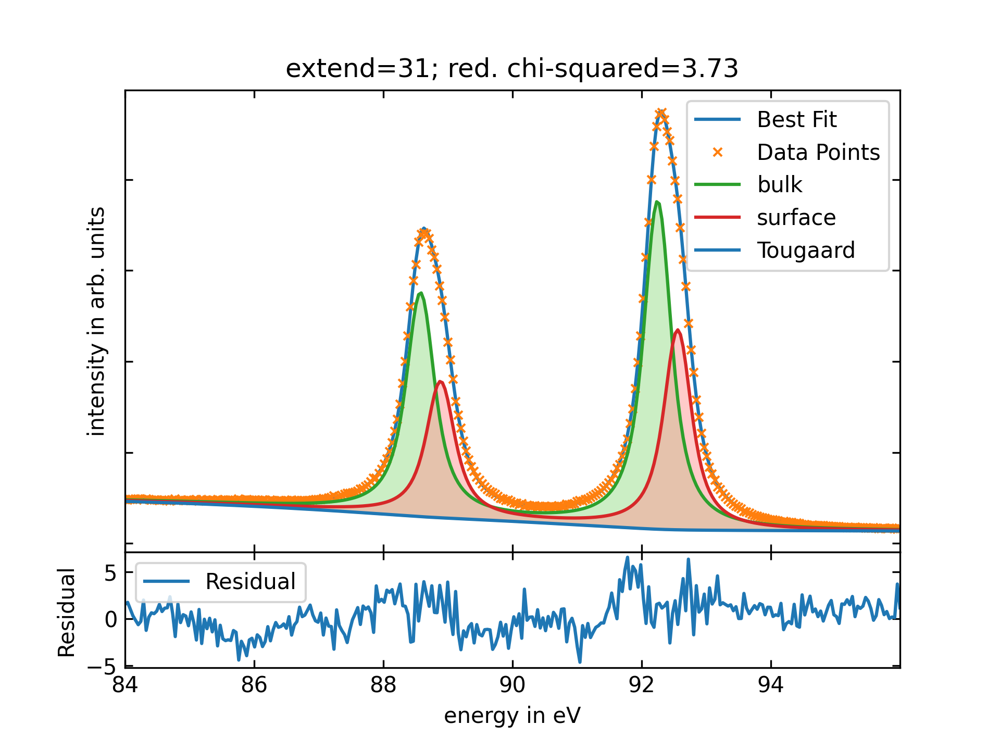

.. _BGModels:

Background Models
=================
.. index:: background; Tougaard, Shirley, Slope

.. _ShirleyBG:

:py:class:`ShirleyBG`
_____________________

.. autoclass:: lmfitxps.models.ShirleyBG
    :exclude-members: guess, __init__, _set_paramhints_prefix
    :noindex:
.. note::
   The class functions are inherited from the lmfit Model class. For details, please refer to their documentation at
   `lmfit Model Class Methods <https://lmfit.github.io/lmfit-py/model.html#model-class-methods>`_.

.. _TougaardBG:

:py:class:`TougaardBG`
______________________

.. autoclass:: lmfitxps.models.TougaardBG
    :exclude-members: guess, __init__, _set_paramhints_prefix
    :noindex:

.. note::
   The class functions are inherited from the lmfit Model class. For details, please refer to their documentation at
   `lmfit Model Class Methods <https://lmfit.github.io/lmfit-py/model.html#model-class-methods>`_.

.. _extend_parameter:

The 'extend' parameter in :ref:`TougaardBG`
-------------------------------------------
.. index:: extend parameter; TougaardBG

The challenge in calculating an approximation to the Tougaard background involves the following:

*The factor B is adjusted to give zero intensity in a region between 30 and 50 eV below the characteristic peak structure* [4]_.

That's due to:

*[...] that the peaks extend to ∼30 eV on the low energy side of the characteristic peaks. The intensity in this energy range arises from the intrinsic (or shake-up) electrons.* [4]_ [5]_

However, in practice, measuring high-resolution spectra across such a broad energy range is typically unfeasible.

Due to the nature of the Tougaard background, one encounters the integral:

.. math::

    B_T(E) = \int_{E}^{\infty} \frac{B \cdot T}{{(C + C_d \cdot T^2)^2} + D \cdot T^2} \cdot y(E') \, dE'

| It's worth noting that the upper bound of the integral is set to :math:`\infty`. However, experimental data collection usually occurs within a finite energy range. Consequently, the need for suitable approximations to this integral arises.
| A common approach is to limit the integral to the measured energy range. By doing so, the Tougaard integral approaches :math:`0` for the rightmost energy values (depending on the choosen constant!), leading to an inaccurate approximation of the measured data. To address this issue, the background is modified using the following equation:

.. math::

    B(E) = B_T(E) + B_C

Here, :math:`B_C` is a constant term. However, when dealing with substantial asymmetry in the observed peaks, we found empirically that this approach using an added constant does not lead to an accurate approximation of the background.
To generate such a background, the :ref:`TougaardBG` -model could be used with ``extend`` set to :math:`0` and an additional :mod:`ConstantModel` from `lmfit <https://lmfit.github.io/lmfit-py/builtin_models.html#constantmodel>`_.

.. code-block:: python

    import lmfit
    import lmfitxps

    tougaard_bg=lmfitxps.models.TougaardBG(prefix='tougaard_', independent_vars=['y', 'x'])
    const_bg=lmfit.models.ConstantModel(prefix='const_')

    bg_model=tougaard_bg+const_bg

    params = lmfit.Parameters()
    params.add('tougaard_extend', value=0)

    # Set all other parameters

| Using this background model, an *Au4f* spectrum was fitted. To model the dublett structure, a convolution of a gaussian with doniach profiles was used as implemented in :py:class:`ConvGaussianDoniachDublett`.
| All peaks parameters were fixed and not varied in the fit to make it possible to compare the effect of different values for the ``extend`` parameter.

As shown in the figure below, the combination of :ref:`TougaardBG` and :mod:`ConstantModel` already leads to a good agreement between fit and experimental data.

Due to the small asymmetry of the *Au4f*-signal only small improvement of the fit was achieved by using  :math:`extend` `!=` :math:`0`. This is shown in the four figures below.
The ``reduced chi-squared``, which judges the agreement between model and experimental data, is only slightly decreased using :math:`28 \leq \text{extend} \leq 30`. In addition, the figure below confirms, that using the :ref:`TougaardBG` with :math:`extend!=0` is valid for modeling the background too.

+-------------+-------------+
|  |extend28| |  |extend29| |
+-------------+-------------+
|  |extend30| |  |extend31| |
+-------------+-------------+

The following figure illustrates the difference between :math:`B_T(\text{extend}) - (B_T(\text{extend}=0) + B_C)` and also displays the variation in residuals between models where :math:`\text{extend} \neq 0` and the model with :math:`\text{extend} = 0`.

Clear patterns emerge among the backgrounds when :math:\text{extend} \neq 0, exhibiting a nearly linear behavior as they move away from the peak. In contrast, the model with :math:\text{extend} = 0 displays a distinct parabolic shape, as illustrated in the figure below.

If the parabolic characteristic of the Tougaard background is too pronounced, the approximated Tougaard background with :math:\text{extend} = 0 often intersects the data short below the fitted peak signal. This behavior does not fulfill the intended function of approaching the measured background around 30-50 eV on the low-energy side beneath the peak, which accounts for previously mentioned shake-up electrons.

Nevertheless, when compared to an average background value of approximately :math:I = 2700 counts, discrepancies among various models remain within a confined range of about 2%.

.. collapse:: To see the source code for generating the extend-parameter plots, please expand:

    .. literalinclude:: ../examples/tougaard_extend.py

.. _SlopeBG:

:py:class:`SlopeBG`
___________________

.. autoclass:: lmfitxps.models.SlopeBG
    :exclude-members: guess, __init__, _set_paramhints_prefix
    :noindex:
    :noindexentry:

.. note::
   The class functions are inherited from the lmfit Model class. For details, please refer to their documentation at
   `lmfit Model Class Methods <https://lmfit.github.io/lmfit-py/model.html#model-class-methods>`_.

References
__________
.. [1] Hesse, R., Denecke, R. (2011). Improved Tougaard background calculation by introduction of fittable parameters for the inelastic electron scattering cross-section in the peak fit of photoelectron spectra with UNIFIT 2011.,43(12), 1514–1526. https://doi.org/10.1002/sia.3746
.. [2] Tougaard, S. (1987). Low energy inelastic electron scattering properties of noble and transition metals. Solid State Communications, 61(9), 547–549. https://doi.org/10.1016/0038-1098(87)90166-9
.. [3] Tougaard, S. (1997). Universality Classes of Inelastic Electron Scattering Cross-sections. Surf. Interface Anal., 25: 137-154. https://doi.org/10.1002/(SICI)1096-9918(199703)25:3<137::AID-SIA230>3.0.CO;2-L
.. [4] Tougaard, S. (2021). Practical guide to the use of backgrounds in quantitative XPS. Journal of Vacuum Science & Technology A; 39 (1): 011201. https://doi.org/10.1116/6.0000661
.. [5] Tougaard, S. (1986). Background removal in x-ray photoelectron spectroscopy: Relative importance of intrinsic and extrinsic processes. Physical Review, 34(10), 6779–6783. https://doi.org/10.1103/physrevb.34.6779
.. [6] Shirley, D. A. (1972). High-Resolution X-Ray photoemission spectrum of the valence bands of gold. Physical Review, 5(12), 4709–4714. https://doi.org/10.1103/physrevb.5.4709
.. [7] Jansson, C., Tougaard, S., Beamson, G., Briggs, D., Davies, S.F., Rossi, A., Hauert, R., Hobi, G., Brown, N.M.D., Meenan, B.J., Anderson, C.A., Repoux, M., Malitesta, C. and Sabbatini, L. (1995), Intercomparison of algorithms for background correction in XPS. Surf. Interface Anal., 23: 484-494. https://doi.org/10.1002/sia.740230708
.. [8] Herrera-Gomez, A., Bravo-Sanchez,M., Aguirre-Tostado, F.S., Vazquez-Lepe, M.O. (2013) The slope-background for the near-peak regimen of photoemission spectra, Journal of Electron Spectroscopy and Related Phenomena, (189), 76-80. https://doi.org/10.1016/j.elspec.2013.07.006.