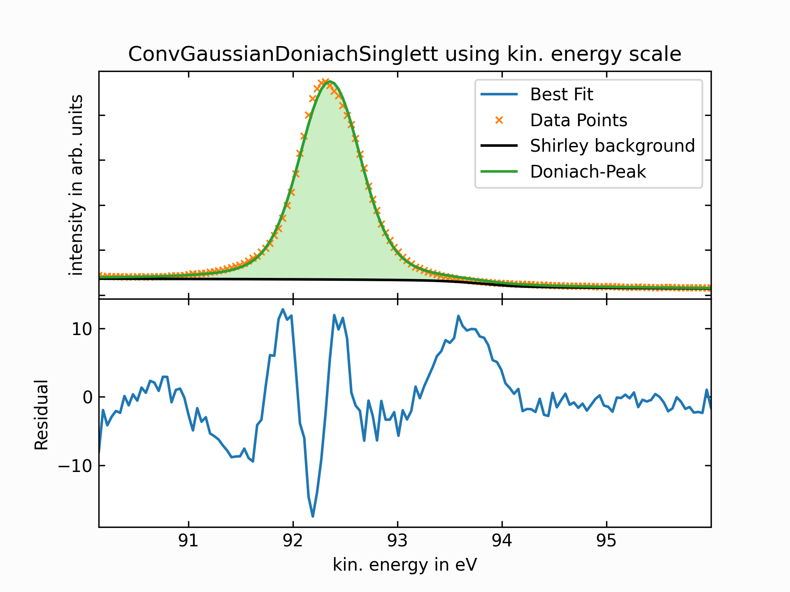
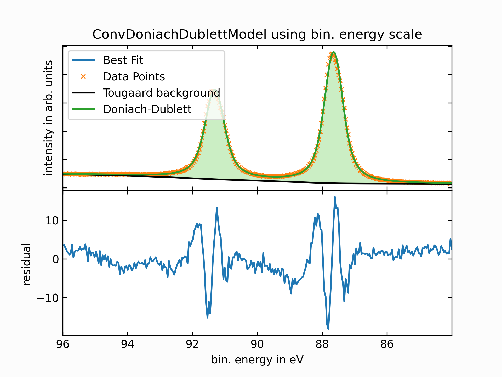
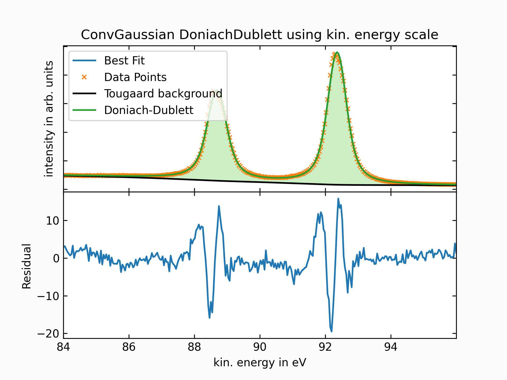

Getting Started
===============

Welcome to ``lmfitxps``, a small Python package designed as an extension for the popular `lmfit package <https://lmfit.github.io/lmfit-py/intro.html#>`_, specifically tailored for X-ray Photoelectron Spectroscopy (XPS) data analysis.

While ``lmfit`` provides simple tools to build complex fitting models for non-linear least-squares problems and applies these models to real data, as well as introduces several built-in models, ``lmfitxps`` acts as an extension to ``lmfit`` designed for XPS data analysis. 
``lmfitxps`` provides a comprehensive set of functions and models that facilitate the fitting of XPS spectra.

Although ``lmfit`` already provides several useful models for fitting XPS data, it often proves insufficient in adequately representing experimental XPS data out of the box. In the context of XPS experiments, the observed data is a convolution of both the sample's underlying physical properties and a Gaussian component arising from experimental broadening.

This Gaussian distribution serves as an effective approximation for the convolution of three distinct Gaussian broadening functions, each of which contributes to the complex interplay inherent in the photoemission process:

#. Broadening caused by the excitation source.
#. Broadening resulting from thermal broadening and vibration modes (phonon broadening, depending on the material).
#. Broadening introduced by the analyzer/spectrometer.

For further details, please refer to, for example, the `Practical guide for curve fitting in x-ray photoelectron spectroscopy`_ by G.H. Major et al.

.. _Practical guide for curve fitting in x-ray photoelectron spectroscopy: https://pubs.aip.org/avs/jva/article/38/6/061203/1023652/Practical-guide-for-curve-fitting-in-x-ray

``lmfitxps`` therefore provides convolution functions based on scipy's and numpy's convolution functions to enable users to build custom `lmfit CompositeModels <https://lmfit.github.io/lmfit-py/model.html#lmfit.model.CompositeModel>`_ using convolution of models. In addition, ``lmfitxps`` provides several pre-built models that use convolutions with model functions from lmfit and offer users the following options:

.. table:: Peak-like/Step-like Models
   :widths: 35 65

   +-------------------------------------------+------------------------------------------------------------+
   | Model                                     | Description                                                |
   +===========================================+============================================================+
   |                                           | Convolution of a Gaussian with a Doniach lineshape used to |
   | ``ConvGaussianDoniachSinglett``           | fit singlet XPS peaks such as *s-orbitals*.                |
   |                                           |                                                            |
   +-------------------------------------------+------------------------------------------------------------+
   |                                           | Convolution of a Gaussian with a pair of Doniach lineshapes|
   | ``ConvGaussianDoniachDublett``            | used to fit doublet XPS peaks such as *p-, d-, f-orbitals*.|
   |                                           |                                                            |
   +-------------------------------------------+------------------------------------------------------------+
   |                                           | Convolution of a Gaussian with a Fermi Dirac Step function |
   | ``FermiEdgeModel``                        | using the thermal distribution lineshape from lmfit.       |
   |                                           |                                                            |
   +-------------------------------------------+------------------------------------------------------------+

In addition to models for fitting signals in XPS data, ``lmfitxps`` introduces several background models that can be included in fit models instead of subtracting precalculated backgrounds. This is known as an active approach as suggested by `A. Herrera-Gomez <https://doi.org/10.1002/sia.5453>`_ and generally leads to better fit results.
The available background models are:

.. table:: Background Models
   :widths: 25 75

   +-------------------------------------------+------------------------------------------------------------+
   | Model                                     | Description                                                |
   +===========================================+============================================================+
   |    ``ShirleyBG``                          | The commonly used step-like Shirley background.            |
   +-------------------------------------------+------------------------------------------------------------+
   |    ``TougaardBG``                         | The Tougaard background based on four-parameter loss       |
   |                                           | function (4-PIESCS) as suggested by                        |
   |                                           | `R.Hesse <https://doi.org/10.1002/sia.3746>`_.             |
   +-------------------------------------------+------------------------------------------------------------+
   |    ``SlopeBG``                           | Calculates a sloping background                             |
   +-------------------------------------------+------------------------------------------------------------+

.. _R.Hesse: https://doi.org/10.1002/sia.3746

In addition to these discussed models, ``lmfitxps`` provides all underlying functions that serve as bases for these models. Furthermore, it includes functions for removing Tougaard and Shirley background components before performing data fitting.

Installation
============

Stable Version
--------------

To install the stable version of ``lmfitxps``, simply use pip::

    $ pip install lmfitxps

If required packages were not automatically installed during pip installation or are not yet present on your system, please install these requirements:

.. code-block::

    lmfit>=1.1.0
    matplotlib>=3.6
    numpy>=1.19
    scipy>=1.6

Development Version
-------------------

To install the development version or contribute to ``lmfitxps``, please clone the GitHub repository:

.. code-block:: sh

    $ git clone https://github.com/Julian-Hochhaus/lmfitxps.git

General Workflow for Predefined Models
---------------------------------------

Using one of the predefined models in `lmfitxps` typically follows this schematic approach:

.. code-block:: python

    import numpy as np
    from lmfitxps.models import ChoosenModel

    # Import your data, ensuring that energy (x) and intensity (y) values are stored in arrays
    x = np.array([...])  # Replace with your energy data
    y = np.array([...])  # Replace with your intensity data

    # Initialize the model
    model = ChoosenModel(prefix='choosen_model_')  # Model parameters will have the specified prefix

    # Define initial parameters for the model
    params = model.make_params(param1=10, param2=40)

    # Fit the model to the data
    result = model.fit(y, params, x=x)

    # Access the fit results
    print(result.fit_report())

The `result` object, which is an instance of the `ModelResult` class, contains several important properties:

- **`fit_report()`**: Returns a printable fit report containing fit statistics and best-fit values along with uncertainties and correlations.
- **`best_fit`**: The model function evaluated with best-fit parameters.
- **`residual`**: Holds the residuals—the difference between observed data and fitted model.
- **`eval_components()`**: Evaluates each component of a composite model function.
- **Fit Statistics**: Various parameters indicating goodness-of-fit, such as Akaike Information Criterion (`aic`), Bayesian Information Criterion (`bic`), best-fit chi-square statistics (`chisqr`), and reduced chi-square (`redchi`).

For additional details about the `ModelResult` class and its methods and attributes, please refer to
`lmfit ModelResult documentation <https://lmfit.github.io/lmfit-py/model.html#the-modelresult-class>`_.

Usage Examples
==============

FermiModel
----------

.. |fermibin| image:: ../examples/plots/plot_fermi_bin.png
   :width: 100%
   :target: ../examples/plots/plot_fermi_bin.png

.. |fermikin| image:: ../examples/plots/plot_fermi_kin.png
   :width: 100%
   :target: ../examples/plots/plot_fermi_kin.png

+---------------+---------------+
| |fermibin|    | |fermikin|    |
+---------------+---------------+

.. collapse:: To see source code, please expand:

    .. literalinclude:: ../examples/Example_FermiEdgeModel.py

ConvGaussianDoniachSinglett with ShirleyBG Model
------------------------------------------------

.. |singlettbin| image:: ../examples/plots/plot_singlett_bin.png
   :width: 100%
   :target: ../examples/plots/plot_singlett_bin.png

+---------------+---------------+
| |singlettbin| | |singlettkin| |
+---------------+---------------+

.. collapse:: To see source code, please expand:

    .. literalinclude:: ../examples/example_convgaussiandoniachsinglett.py

ConvGaussianDoniachDublett with TougaardBG Model
------------------------------------------------

+---------------+---------------+
| |dublettbin|  | |dublettkin|  |
+---------------+---------------+

.. collapse:: To see source code, please expand:

    .. literalinclude:: ../examples/Example_ConvGaussianDoniachDublett.py

- In all cases , it can be observed that fits for binding energy and kinetic energy align well.
- The selected models do not perfectly match all data; in practice , a second component would likely be necessary to achieve optimal fitting results . Here , these models are used purely as examples.
- Due to how fitting procedures operate , small differences between fits for binding energy and kinetic energy scales are expected (most easily seen in residuals). This is a natural consequence of fitting processes where only local minima may be reached.