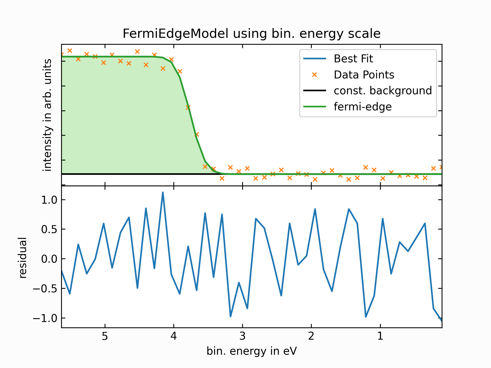

Usage examples
==============
.. include:: note.rst

As the **`lmfitxps`** package serves as an extension to the `lmfit` package, the
`lmfit documentation <https://lmfit.github.io/lmfit-py/intro.html>`_ is an excellent
starting point for understanding how to work with `lmfitxps`.

The predefined models in `lmfitxps` include the :ref:`BGModels` and the :ref:`PeakModels`,
which are implemented in a manner similar to the
`lmfit built-in models <https://lmfit.github.io/lmfit-py/builtin_models.html>`_. These models
can be utilized with comparable syntax and workflows.

General Workflow for Predefined Models
---------------------------------------

Using one of the predefined models in `lmfitxps` typically follows this schematic approach:

.. code-block:: python

    import numpy as np
    from lmfitxps.models import ChoosenModel

    # Import your data, ensuring that energy (x) and intensity (y) values are stored in arrays
    x = np.array([...])  # Replace with your energy data
    y = np.array([...])  # Replace with your intensity data

    # Initialize the model
    model = ChoosenModel(prefix='choosen_model_')  # Model parameters will have the specified prefix

    # Define initial parameters for the model
    params = model.make_params(param1=10, param2=40)

    # Fit the model to the data
    result = model.fit(y, params, x=x)

    # Access the fit results
    print(result.fit_report())

The `result` object, an instance of the `ModelResult` class, holds, besides others, the following properties:

- `fit_report()`: Return a printable fit report. It contains fit statistics and best-fit values with uncertainties and correlations..

- `best_fit`: The model function, evaluated with best-fit parameters

- `residual`: Holds the residual, the difference between the data and best fitted model.

- `eval_components()`: Allows to evaluate each component of a composite model function.

- ** Fit statistics** : Various parameters indicating the goodness of the fit, such as Akaike Information Criterion (`aic`), Bayesian Information Criterion (`bic`), best-fit chi-square statistics ('chisqr`) and the reduced chi-square ('redchi`), etc.

For additional details about the `ModelResult` class and its methods and attributes, please refer to the
`lmfit ModelResult documentation <https://lmfit.github.io/lmfit-py/model.html#the-modelresult-class>`_.

Example Usage of Different Models
---------------------------------

FermiModel
~~~~~~~~~~

+---------------+---------------+
| |fermibin|    | |fermikin|    |
+---------------+---------------+

.. collapse:: To see the source code, please expand:

    .. literalinclude:: ../examples/Example_FermiEdgeModel.py

ConvGaussianDoniachSinglett with ShirleyBG Model
~~~~~~~~~~~~~~~~~~~~~~~~~~~~~~~~~~~~~~~~~~~~~~~~

.. |singlettkin| image:: ../examples/plots/plot_singlett_kin.png
   :width: 100%
   :target: ../examples/plots/plot_singlett_kin.png

+---------------+---------------+
| |singlettbin| | |singlettkin| |
+---------------+---------------+

.. collapse:: To see the source code, please expand:

    .. literalinclude:: ../examples/Example_ConvGaussianDoniachSinglett.py

ConvGaussianDoniachDublett with TougaardBG Model
~~~~~~~~~~~~~~~~~~~~~~~~~~~~~~~~~~~~~~~~~~~~~~~~

.. |dublettbin| image:: ../examples/plots/plot_dublett_bin.png
   :width: 100%
   :target: ../examples/plots/plot_dublett_bin.png

.. |dublettkin| image:: ../examples/plots/plot_dublett_kin.png
   :width: 100%
   :target: ../examples/plots/plot_dublett_kin.png

+---------------+---------------+
| |dublettbin|  | |dublettkin|  |
+---------------+---------------+

.. collapse:: To see the source code, please expand:

    .. literalinclude:: ../examples/Example_ConvGaussianDoniachDublett.py

Notes
~~~~~

- In all cases, one can see that the fits for binding energy and kinetic energy agree well.
- The models were not chosen to perfectly match the data, and in practice, a second component would likely be necessary to achieve a great fit result. Here, the models were used as examples.
- Due to how the fitting procedure works, small differences between the fits for binding and kinetic energy scale are expected (easiest seen in the residual). This is a natural consequence of the fitting process. In most cases only a local minimum is reached.
